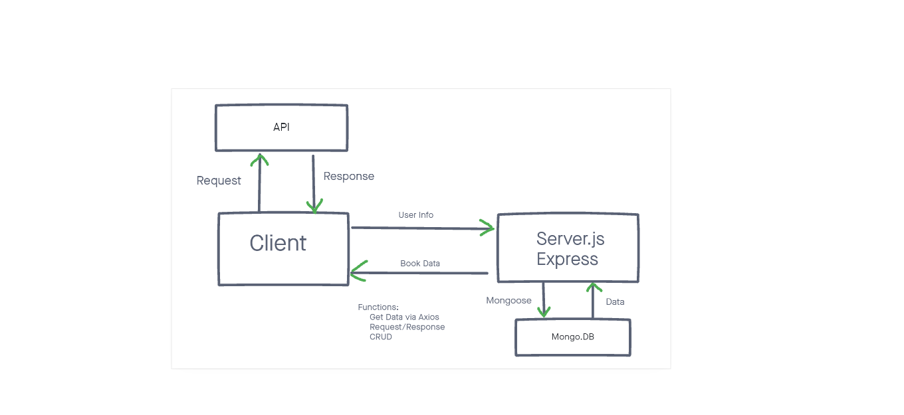
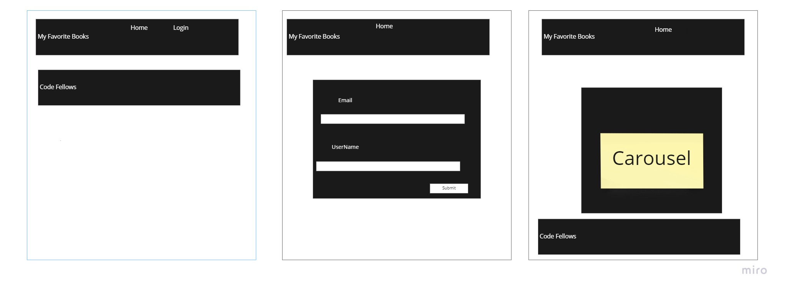

# Can of Books

**Author**: Anthony Turinski, Chris Rarig, and Osborn Del Angel
**Version**: 1.0.0

## Overview

This application displays Books a user has stored in the application

## Getting Started
<!-- What are the steps that a user must take in order to build this app on their own machine and get it running? -->

## Architecture

- Languages: JavaScript, HTML
- Libraries: BootStrap, REACT, Mongo

## Change Log

10-23-2021 Setup back-end server and wrote framework for front-end
10-26-2021 Setup carousel
10-27-2021 Setup login/logout button functions and profile page
10-27-2021 Setup Add a book function
10-28-2021 Setup Delete function 

## Estimates

1. *Name of feature*: Back-end Server

    - *Estimate of time needed to complete*: 2hrs

    - *Start time*: 10-23-2021 3:15 pm

    - *Finish time*: 10-23-2021 6:00pm

    - *Actual time needed to complete*: 2hr and 45 mins

2. *Name of feature*: Front-end Carousel

    - *Estimate of time needed to complete*: 1hrs

    - *Start time*: 10-23-2021 6:00pm

    - *Finish time*: 10-26-2021 2:30pm

    - *Actual time needed to complete*: 4hrs

3. *Name of feature*: Login/Logout

    - *Estimate of time needed to complete*: 1hrs

    - *Start time*: 10-26-2021 11:00pm

    - *Finish time*: 10-27-2021 3:00pm

    - *Actual time needed to complete*: 2hr and 30 mins

4. *Name of feature*: Add Book

    - *Estimate of time needed to complete*: 1hr

    - *Start time*: 10-27-2021 11:00pm

    - *Finish time*: 10-27-2021 12:00am

    - *Actual time needed to complete*: 1hr

5. *Name of feature*: Delete a Book

    - *Estimate of time needed to complete*: 1hr

    - *Start time*: 10-28-2021 10:30pm

    - *Finish time*: 10-28-2021 12:15am

    - *Actual time needed to complete*: 1hr and 45mins

6. *Name of feature*: Update a Book

    - *Estimate of time needed to complete*: 2hr

    - *Start time*: 10-30-2021 3:30pm

    - *Finish time*: 10-30-2021 7:30pm

    - *Actual time needed to complete*: 4hrs

## Credit and Collaborations

